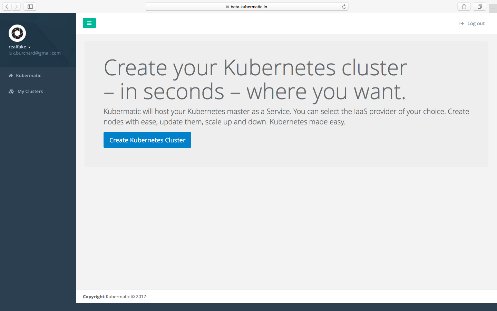
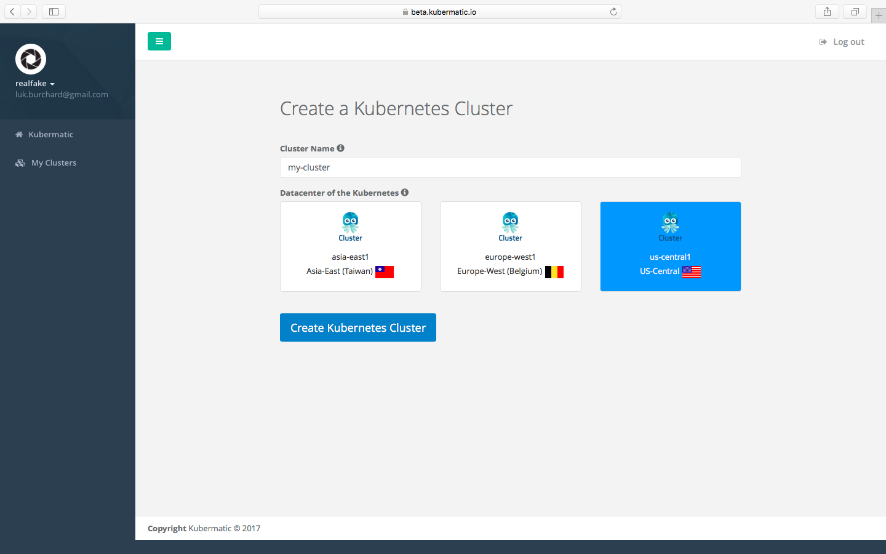
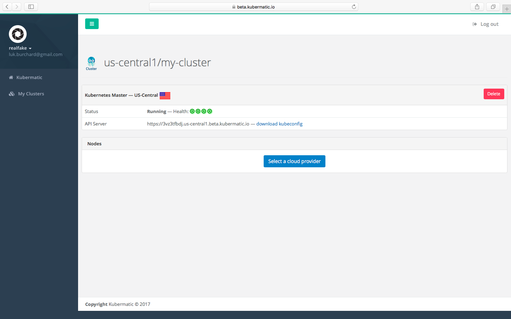
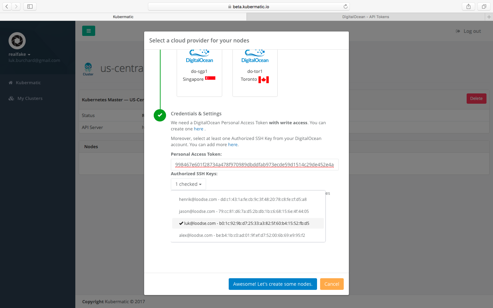
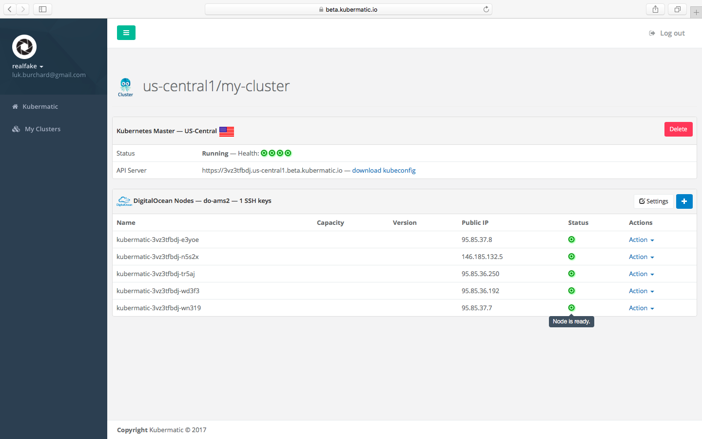

# Outline
Create and overview and architecture docu for users:

Let's start with the following topics:

* What is Kubermatic
  * Differenciate between SaaS and Hosted
* Architecture
* Features
* Usage
  * Create/delete cluster
  * Add/remove nodes
* Launch Stages (similar https://cloud.google.com/terms/launch-stages or https://dcos.io/docs/1.8/overview/feature-maturity/)

Examples for similar documentations are:
http://docs.rancher.com/rancher/v1.3/en/
https://dcos.io/docs/1.8/overview/
https://docs.docker.com/datacenter/ucp/2.0/guides/

-------------

# What is Kubermatic
Coverage{

* Kubernetes as a service
* No Setup
* No Updating
* We provide scaling
* On every platform, gcloud, aws,do, own hardware

}

Kubermatic is a Service which provides Kubernetes for your infrastructure - so you don't have to worry about it. If you are interested to host Kubermatic in your own datacenter you can contact our Sales.

In the following description we are mainly focusing on Kubermatic as a Service, which is publicly availabiliable under https://beta.kubermatic.io.

We setup your cluster and configure your infrastructure so that you can focus on developing your product.
Kubermatic can connect to different cloud providers such as Amazon Web Services, DigitalOcean, Google Cloud or you can host nodes on your on machines.

# Architecture
Coverage{

* Rely on Kubernetes to manage Kubernetes
  * High AV
  * Stability
* API is on master cluster
* Master speeks with Seed clusters
  * Seed is in local datacenter
  * Seed is self managed
* Seed deploys customer components
  * Customer components are fully managed by Kubernetes
* Drawing

}

Our infrastructure consists of 3 main components, which provide maximal availability, without compromising on flexibility.
#### Main Cluster
Our own main cluster runs all user facing services, such as the API, or the Dashboard. All components run using Kubernetes which makes them fault tolerant and scaleable to support even high load scenarios.

#### Seed Cluster
The Seed cluster runs in a Google Cloud datacenter to provide low latency and a reliable internet connection.
It's purpose is to deploy the final customer clusters.
The Seed cluster itself is also managed by Kubernetes which allows it to take advantage of all its benefits.
The master cluster communicates with a selected Seed cluster to deploy a customer cluster.

### Customer cluster.
The customer cluster provides all needed components to run a Kubernetes cluster such as etcd and the Kubernetes master.
The services will be proxied to the nodes of the customer which are located in their datacenter.

# Features
Coverage{

* Install Kubernetes (obviously)
* Update Kubernetes
* Manage nodes
  * Manage Network
  * Init cloud provider

}

# With Kubermatic you can:
#### Use Kubernetes
Modernize your cloud deployment workflow by using all the advanced features that Kubernetes has to offer.

#### Update Kubernetes
We provide live updates of your Kubernetes cluster without disrupting your daily business.
Use all the new features of Kubernetes as you grow scale.

#### Scale your cluster
You can add and remove nodes in our easy to use Dashboard. Just specify the amount of nodes your kubernetes cluster should have and kubermatic scales the cluster up or down to your needs.

# Feature Majority
Coverage {
  * Alpha
  * Beta
  * Public
  * Depreciated

}

#### Alpha
Alpha is an early stage product for which we cant offer any SLA's or API stability. However the workflow of the product is defined but still it is missing features.
It is only available to a small group of customers.

#### Beta
Beta is open to every customer. We provide an API with minor changes in a few cases. All features should be ready to use. This release is mainly used to profile real world usage and performance as well as spotting the last bugs.

#### Public
This release is stable, feature complete and provides a SLA. It is publicly available and meant to be used in production.

#### Deprecated
Those products/features will be removed in a specified time. There is also to further support.

# Roadmap
Coverage {
  * More Node Providers
    * Google Cloud
    * Need more for the roadmap
  * Local Seeds
  * Automatic Scaling
  * Addons

}

We are constantly improving out product to bring the best to our customers, such as...

#### Locality
To provide better connectivity we would like to host our Seed clusters in a local
datacenter such as AWS when the customer is having their nodes on AWS.

#### More Provider Support
We are constantly adding new supported cloud integrations into our product so you can
host your kubernetes cluster on a wider range of platforms.
Our next upcoming providers are:
  * Google Cloud

#### Automatic Scaling
To react on fast growing loads can sometimes be a very difficult task, thats why we will offer automatic scaling of your kubernetes cluster.
By analyzing and predicting your workload we can scale your cluster on demand so customers never have to wait for you and vice versa.

#### Install addons
With Heapster pre installed we provide an easy endpoint for installing addons into your kubernetes cluster.
The provided addons are managed and monitored by our services so you can drink a coffee ☕️😇 and focus on your actual work.

# Usage
Coverage{

* Pics ....

}
### Login:
Navigate to the Dashboard on `https://beta.kubermatic.io`.
And login usign your Github or Google profile.

Click on the `Create Kubernets Cluster` button.

Type in a name for the cluster.
In this example we use `my-cluster`.

You also have to select the locality of the Seed Cluster.

When you are ready click `Create Kubernets Cluster`
This will create the Kubernetes master components for you.

This is view of your cluster.
Here you can monitor the running components.
At the moment all of our components aren't started so they are blue.

Wait up to a few minutes until your cluster is ready.
You see when your cluster is redy after all Components are merked green.

Now Click `Select a cloud provider`.
Here you can select where the actual nodes should be run.
We will choose a DigitalOcean datacenter in Amsterdam to demonstrate the independence of the Seed cluster and the customers nodes.

We have to provide a DigitalOcean ocean token with `Read` and `Write` access for Kubermatic to create nodes.
We also selcet SSH keys saved in the DigitalOcean account to access them later over SSH.

Now we can selct the amout and size of nodes to add to the cluster.

Now we have to wait a few minutes for the nodes to become ready.
This will be indicated by showing the nodes as `Node Ready` in the dashboard.

We can now download the kubeconfig by clicking `download kubeconfig`
We now use the downloaded kubeconfig to connect over kubectl to our new deployed Kubernetes server.

Happy Hacking!
